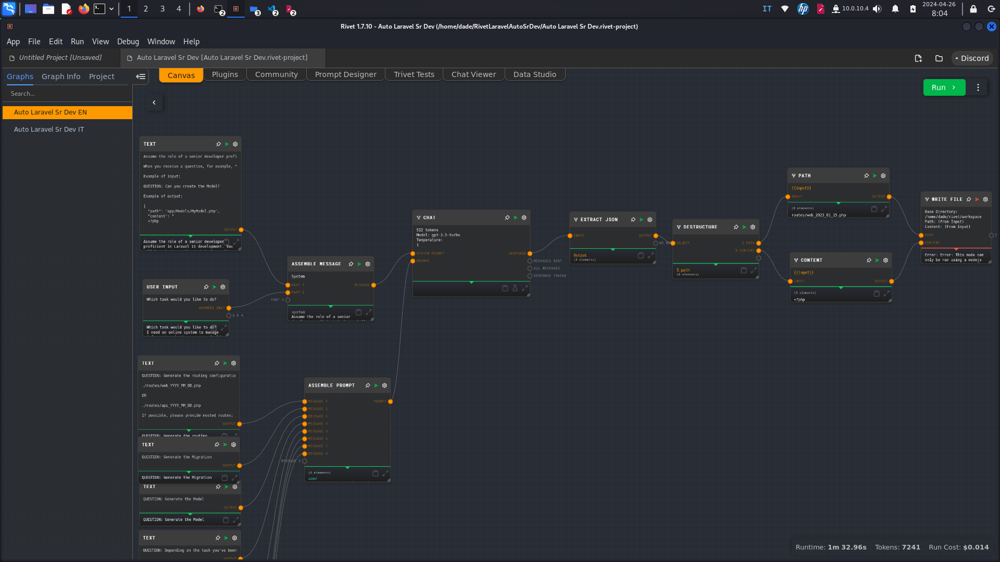
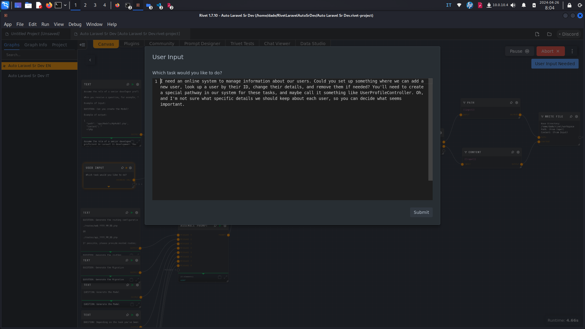
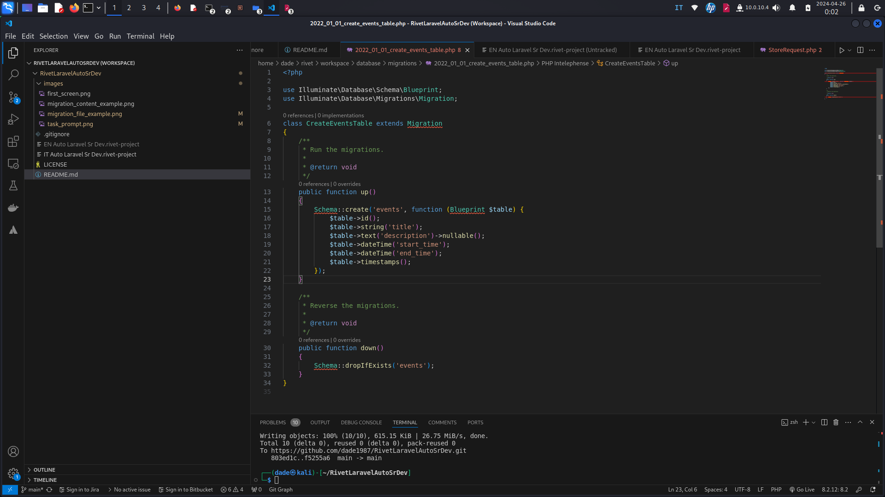

# Laravel Auto Sr Dev Rivet Project

## Overview

This Rivet project leverages OpenAI's generative AI to automatically create Laravel projects starting from a specific task. The aim is to simplify and speed up software component development through automatic code generation, reducing manual workload and enhancing development process efficiency.

## Features

- **Automatic Code Generation:** Automates the creation of models, controllers, requests, and much more.
- **PHPDoc Support:** Each generated file includes well-formed PHPDoc to ensure greater compatibility with tools like PHPStan.
- **Graph-Based Interface:** Uses a graph-based approach to manage and execute development operations.

## Screenshots

### First Screen

### Task Prompt

### Migration Content Example

## Graph Nodes Description

- **Text Nodes:** Each text node represents a specific question that guides the creation of various Laravel components.
- **Write File Nodes:** Manages file writing within the system.
- **User Input:** Accepts user input for custom operations.
- **Chat Nodes:** Integrates the chat system to process requests and return responses in JSON format.

## Setup

### Prerequisites

- [Rivet environment setup](https://rivet.ironcladapp.com/)
- Laravel 11 installed on your development machine.
- Ensure the FS plugin is installed in Rivet for file system operations.

## Installation

- Clone this repository.
- Import the Rivet project using the included configuration file.

## Usage

To run the program, use the Node Executor located in the top right corner of the interface, rather than the Browser Executor. This setup ensures proper execution and management of file operations within the Rivet environment.

Follow the instructions on the nodes to generate the desired components.

## Changelog

### Latest Updates

### 2 May 2024

- **Introduced Flex Code Generator Graph (04 - Flex Code Generator):** A new graph that includes advanced nodes for user input, JSON extraction, and dynamic file writing, enhancing the project's code generation capabilities.

- **Enhanced Chat and Write File Nodes:** Updated configurations to improve handling of JSON data and dynamic file operations, ensuring a more robust and efficient code generation process.

- **Updated Text Node with Detailed Task Instructions:** Modified to provide comprehensive guidelines for generating specific Laravel code components, focusing on JSON formatted responses.

- **Renamed Validation Graph:** Changed the name from 04 - Validation to 05 - Validation to better sequence the graphs following the addition of the new code generator graph.

#### 30 April 2024

- **Enhanced Code Generation Logic:** Improved the algorithms for automatic code generation to handle more complex scenarios and better adapt to specific project requirements. This update ensures higher accuracy in the generation of PHP code and structure.

- **Expanded Graph Node Functionality:** Introduced new graph nodes to handle additional programming tasks and expanded the capabilities of existing nodes to increase the flexibility and power of the development environment.

- **Improved PHPDoc Integrations:** Enhanced the integration with PHPDoc to provide more detailed and useful documentation automatically. This helps in maintaining code quality and compatibility with tools like PHPStan.

- **Updated User Interface Elements:** Refined various elements of the user interface to enhance usability and aesthetics, making the software more intuitive and easier to navigate.

- **Additional Laravel 11 Features Supported:** Added support for new features in Laravel 11, ensuring that the generated projects are up-to-date with the latest framework capabilities.

- **Optimized File System Interactions:** Made significant improvements to how file system operations are handled within the Rivet environment, reducing the potential for errors and increasing performance during file generation and management.

#### 28 April 2024

- **Introduction of Graphs for Environment Installation and Validation:** Added specific graphs for the installation and validation of the Laravel environment, such as "01 - Laravel Environment Installer" and "02 - Validation Environment". This shows a more structured and automated approach to the initial setup and integrity verification of the development environment.

- **Advanced Automation with Shell Scripts:** Included shell commands to automatically configure the Laravel environment with specific dependencies and modules, significantly improving the ease of project setup. This allows developers to quickly start with an optimized configuration.

- **Restructuring and Organization of Modules:** Changes to directory structures and file paths indicate a renewal in module organization, aiming to improve scalability and maintainability of the project.

- **Enhancement of the Validation Graph's Capabilities:** The "04 - Validation" graph with commands for dumpautoload and the configuration of tools such as PHPStan and Safe Rule is crucial to ensuring that the generated code is secure and meets quality standards, increasing the reliability of the developed software.

#### 27 April 2024

- **Added Nwidart Modules Support:** Integration with Nwidart modules allows for more robust modular development, enabling developers to better organize large Laravel applications into separate modules.
- **Optional Filament 3 Support:** Added optional integration with Filament 3, which provides a more advanced administrative interface and enhanced UI components for a better user experience.

### Advantages

- **Modular Development:** Nwidart modules facilitate better scalability and maintainability by segregating the application into discrete modules.
- **Enhanced Admin Panels:** Filament 3 provides tools for quickly building custom admin panels, which can significantly speed up backend development and provide a richer, more interactive user interface.

## Contributing

Contributions are welcome. To contribute, please open an issue to discuss what you would like to change or directly send a pull request with your modifications.

## License

This project is released under the GNU General Public License v3.0.
