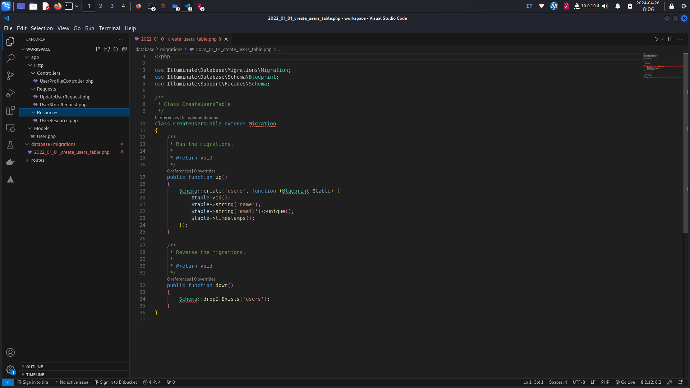

# Laravel Auto Sr Dev Rivet Project

## Overview

This is a Rivet project that leverages OpenAI's generative AI to automatically create Laravel projects starting from a specific task. The aim is to simplify and speed up software component development through automatic code generation, reducing manual workload and enhancing development process efficiency.
Features

- Automatic Code Generation: Automates the creation of models, controllers, requests, and much more.
- PHPDoc Support: Each generated file includes well-formed PHPDoc to ensure greater compatibility with tools like PHPStan.
- Graph-Based Interface: Uses a graph-based approach to manage and execute development operations.

## Screenshots

### First Screen

### Task Prompt

### Migration File Example

### Migration Content Example

## Graph Nodes Description

- Text Nodes: Each text node represents a specific question that guides the creation of various Laravel components.
- Write File Nodes: Manages file writing within the system.
- User Input: Accepts user input for custom operations.
- Chat Nodes: Integrates the chat system to process requests and return responses in JSON format.

## Setup

### Prerequisites

- [Rivet environment setup](https://rivet.ironcladapp.com/)
- Laravel 11 installed on your development machine.

## Installation

- Clone this repository.
- Import the Rivet project using the included configuration file.

## Usage

Using the system requires a basic understanding of how the nodes and connections in the Rivet project work. Follow the instructions on the nodes to generate the desired components.
Contributing

Contributions are welcome. To contribute, please open an issue to discuss what you would like to change or directly send a pull request with your modifications.

## License

This project is released under the GNU General Public License v3.0